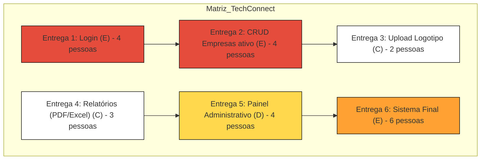

```mermaid

graph TD
subgraph Matriz_TechConnect

A1["Entrega 1: Login (E) - 4 pessoas"]:::vermelho -->
A2["Entrega 2: CRUD Empresas ativo (E) - 4 pessoas"]:::vermelho -->
A3["Entrega 3: Upload Logotipo (C) - 2 pessoas"]:::branco

B1["Entrega 4: Relatórios (PDF/Excel) (C) - 3 pessoas"]:::branco -->
B2["Entrega 5: Painel Administrativo (D) - 4 pessoas"]:::amarelo -->
B3["Entrega 6: Sistema Final (E) - 6 pessoas"]:::laranja

end

classDef branco fill:#ffffff, stroke:#000, stroke-width:1px;
classDef laranja fill:#FFA233, stroke:#000, stroke-width:1px;
classDef amarelo fill:#FFD84D, stroke:#000, stroke-width:1px;
classDef vermelho fill:#E64C3C, stroke:#000, stroke-width:1px;

```
