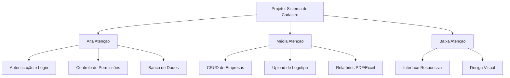

```mermaid

flowchart TD

A[Projeto: Sistema de Cadastro] --> B[Alta Atenção]
A --> C[Média Atenção]
A --> D[Baixa Atenção]

B --> B1[Autenticação e Login]
B --> B2[Controle de Permissões]
B --> B3[Banco de Dados]

C --> C1[CRUD de Empresas]
C --> C2[Upload de Logotipo]
C --> C3[Relatórios PDF/Excel]

D --> D1[Interface Responsiva]
D --> D2[Design Visual]

```
